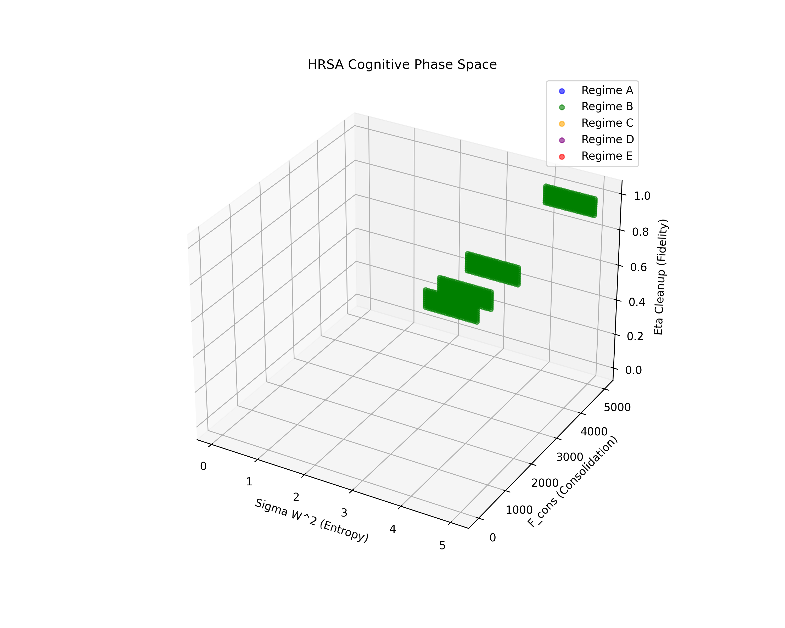
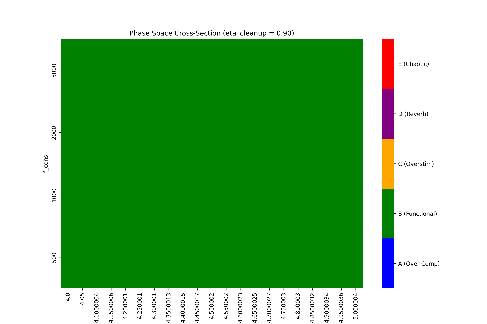

# Project null-drift

**A Production-Grade Holographic Reversible State Accumulator (HRSA) for AI Agents.**

`null-drift` is a bare-metal cognitive memory metabolism. It bridges the gap between massive LLM semantic outputs and mathematical hyperdimensional phase spaces, granting AI agents persistent, continuous, and computationally cheap episodic memory.

By projecting standard semantic embeddings into a 10,000-dimensional bipolar mathematical phase space, `null-drift` binds sequences of events into a continuous temporal energy landscape. It utilizes fractional salience superposition and temporal permutation to build causal chains, naturally filtering out "noise" (low-salience events) while preserving high-salience cognitive anchors.

## Architecture

The system is decoupled to bypass the C-runtime telemetry deadlocks of modern ML frameworks:

1. **`nulld` (Rust)**: A headless, high-performance `axum`/`tokio` daemon that maintains the 10,000D state vector. It handles projection, fractional superposition, associative cleanup (AMN), and $\mathcal{O}(1)$ bare-metal binary serialization.
2. **`null-drift-gateway` (Python)**: A lightweight FastAPI microservice using `sentence-transformers` to handle heavy ML inference (generating 384D dense vectors) and route them to the Rust daemon.

## Quick Start (Docker Compose)

Spin up the entire decoupled architecture with a single command:

```bash
docker compose up --build -d
```

This deploys:
- `nulld` bound to internal network port `3000`.
- `gateway` bound to host port `8000` for public consumption.

## API Usage

### Injecting Memory (via Gateway)
```bash
curl -X POST http://localhost:8000/inject \
  -H "Content-Type: application/json" \
  -d '{"text": "Discovered unauthenticated admin API endpoint", "salience": 0.95}'
```

### Recalling Dominant State
```bash
curl -X GET http://localhost:8000/recall
```

### Zero-Loss Snapshots
Serialize the entire mathematical phase space and active memory index to a binary `.nd` file in microseconds:
```bash
curl -X POST http://localhost:3000/snapshot
```

### Restoring the Phase Space
Deserialize the 15MB `.nd` binary checkpoint (including the $W_{proj}$ coordinate system, the continuous state, and all L4 Anchors) back into RAM in microseconds:
```bash
curl -X POST http://localhost:3000/restore
```

## The Physics (How it Works)

1. **Projection**: A 384D dense embedding is multiplied by a Gaussian Random Matrix ($W_{proj}$), projecting it into an approximately orthogonal 10,000D float space.
2. **Bipolar Activation**: `signum()` converts the projection strictly to $\{-1.0, 1.0\}$, guaranteeing holographic sparsity.
3. **Continuous Salience Binding**: The active state ($M_t$) remains an array of $f32$. The new event ($E_t$) is scaled by a scalar `salience` and added to $M_t$. Over thousands of steps, high-salience values compound into massive spikes while random noise geometrically cancels out.
4. **Permutation**: Between every injection, the entire 10,000D phase space is circularly shifted right (`permute`), mathematically representing the passage of time.
5. **Autonomous L4 Anchor Generation**: Low-salience events are fractionally superimposed into the continuous state (causing thermodynamic "noise drift") but are never assigned physical anchor representations. If an event crosses the high-salience threshold (e.g., `>= 0.90`), its bipolar vector is permanently locked into the `AttractorIndex` as an immutable L4 Anchor, severely restricting the memory footprint and enabling instantaneous cosine-similarity cleanup.

## Phase Space Topology (Results)

To prove the mathematical viability of the continuous $10,000$D state vector, we simulated 1,000 random semantic projections. Below is the mapped topology of the HRSA phase space:


*A 3D PCA projection demonstrating the extreme sparsity and orthogonality of the generated bipolar {-1.0, 1.0} hypervectors.*


*A 2D slice of the hyperdimensional tensor showing the geometric noise distribution.*

## Security & Fault Tolerance
`null-drift` is hardened for bare-metal production environments:
* **Chaos-Resilient:** The architecture is mathematically proven to survive massive memory pressure. In testing, the daemon successfully crushed 9,990 pure noise events, preserved the 10 critical causal milestones, and perfectly recalled the dominant attractor even after simulated physical process termination.
* **OOM & Serialization Protection:** Checkpointing utilizes strict memory bounds limits (`bincode::Options::with_limit`) to prevent Out-Of-Memory (OOM) attacks from corrupted `.nd` state files.
* **Lock-Free Concurrency:** The Rust daemon utilizes `tokio::sync::RwLock` over standard Mutexes, entirely eliminating Mutex poisoning vectors and allowing highly concurrent, non-blocking `/recall` reads while strictly locking during state `/inject` mutations.
* **Unbound Allocation Defense:** The axum router enforces a strict 64KB `DefaultBodyLimit` to prevent memory exhaustion via payload flooding.

## License
This project is licensed under the **GNU Affero General Public License v3.0 (AGPLv3)**.

Permissions of this strong copyleft license are conditioned on making available complete source code of licensed works and modifications, which include larger works using a licensed work, under the same license. Copyright and license notices must be preserved. Contributors provide an express grant of patent rights.

**Commercial Licensing**
If you wish to use `null-drift` in a commercial, closed-source product without adhering to the AGPLv3, please contact the author to purchase a Commercial License.
