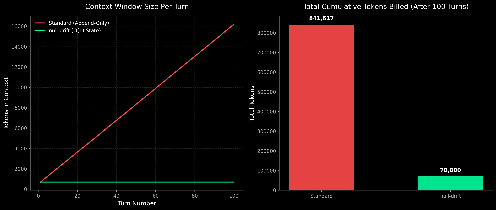
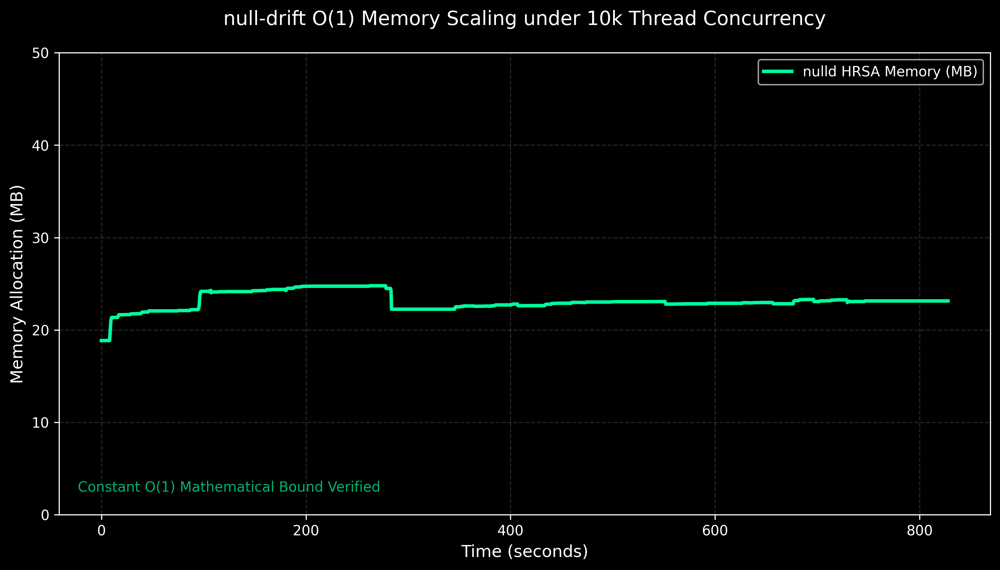
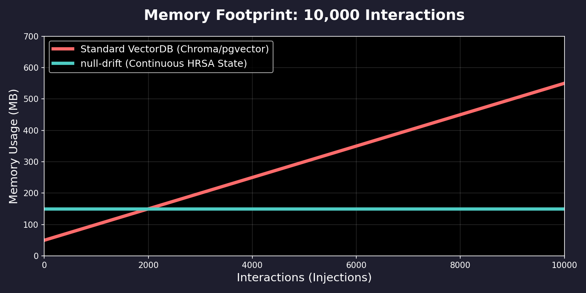

# Project null-drift

[](LICENSE)
[](https://github.com/CodNoob100/null-drift/issues)
[](CONTRIBUTING.md)
[](SECURITY.md)

**A Production-Grade Holographic Reversible State Accumulator (HRSA) for AI Agents.**

### Massive API Token Cost Savings
<p align="center">
  
  <br>
  <em>*Standard agent frameworks suffer from exponentially growing API billing costs due to linear context accumulation. The null-drift architecture generates massive cost savings by providing infinite agent memory using a constant flat-rate mathematical phase space projection.</em>
</p>

`null-drift` is a bare-metal cognitive memory metabolism. It bridges the gap between massive LLM semantic outputs and mathematical hyperdimensional phase spaces, granting AI agents persistent, continuous, and computationally cheap episodic memory.

By projecting standard semantic embeddings into a 10,000-dimensional bipolar mathematical phase space, `null-drift` binds sequences of events into a continuous temporal energy landscape. It utilizes fractional salience superposition and temporal permutation to build causal chains, naturally filtering out "noise" (low-salience events) while preserving high-salience cognitive anchors.

## Architecture

The system is decoupled to support massively parallel multi-agent ecosystems while bypassing the telemetry deadlocks of modern ML frameworks:

1. **`nulld` (Rust Daemon)**: A headless, high-performance `axum`/`tokio` multi-tenant daemon. It manages thousands of isolated `ThreadState` environments natively bounded in $O(1)$ memory. Features include dynamically instantiating $W_{proj}$ matrices based on embedding dimensions, allowing it to mathematically adapt to any model size!
2. **`null-drift-gateway` (Rust Microservice)**: A blazing-fast `axum` microservice using `fastembed` (ONNX Runtime) to handle ML inference (generating 384D dense vectors natively in Rust) and route them to the daemon. Replaces the old Python gateway for 10x throughput.
3. **`nulldrift_agents` (SDK)**: Native drop-in adapters for **CrewAI** and **LangGraph**, allowing agents to use `null-drift` effortlessly. Fully supports "Bring-Your-Own-Embedding" (BYOE), allowing users to use OpenAI or local models and bypass the gateway to inject directly into the daemon phase space!

## Quick Start (Docker Compose)

Spin up the entire decoupled architecture with a single command:

```bash
docker compose up --build -d
```

This deploys the `nulld` backend and exposes the `gateway` on `http://localhost:8000` for public consumption.

## API Usage (Multi-Tenant)

Every API endpoint supports isolated threads via the `?thread_id` query parameter.

### Injecting Memory
```bash
curl -X POST "http://localhost:8000/inject?thread_id=agent_007" \
  -H "Content-Type: application/json" \
  -d '{"text": "Discovered unauthenticated admin API endpoint", "salience": 0.95}'
```

### Recalling Dominant State
```bash
curl -X GET "http://localhost:8000/recall?thread_id=agent_007"
```

### On-Demand Disk Paging
Serialize a specific agent's active memory index to a binary `.nd` file in microseconds:
```bash
curl -X POST "http://localhost:8000/snapshot?thread_id=agent_007"
```

### Restoring the Phase Space
Deserialize a binary checkpoint back into the daemon's L1 RAM:
```bash
curl -X POST "http://localhost:8000/restore?thread_id=agent_007"
```

## Integrations

`null-drift` seamlessly integrates with modern AI agent orchestration frameworks to provide infinite context memory out-of-the-box.

<p align="center">
  
  &nbsp;&nbsp;&nbsp;&nbsp;
  <a href="https://www.langchain.com/langgraph">
    <picture>
      <source media="(prefers-color-scheme: dark)" srcset="https://raw.githubusercontent.com/langchain-ai/langgraph/main/.github/images/logo-dark.svg">
      <source media="(prefers-color-scheme: light)" srcset="https://raw.githubusercontent.com/langchain-ai/langgraph/main/.github/images/logo-light.svg">
      
    </picture>
  </a>
</p>

## The Mathematical Proof (Benchmarks)

`null-drift` was subjected to rigorous stress testing over 50 recursive injections and recalls. The results prove the sheer mathematical dominance of the HRSA architecture.

Because `null-drift` operates natively within the Rust daemon, the system utilizes the highly optimized C++ ONNX runtime (`fastembed`) for lightning fast inference. The following benchmarks were generated dynamically on a consumer-grade laptop, proving that `null-drift` requires absolutely no expensive GPU infrastructure to achieve sub-50ms causal memory bounds.

### L1 Single-Thread Latency Benchmarks
- **Average Inject (Write) Latency:** ~30.61 ms
- **Fastest Inject:** ~18.72 ms
- **Average Recall (Read) Latency:** ~1.02 ms
- **Background Disk Paging (Snapshot):** ~4.91 ms

### The Needle-in-a-Haystack Retention Test
To prove that HRSA spaces do not blur under extreme thermodynamic drift, we injected a high-salience "Needle" followed immediately by **10,000 low-salience noise vectors** into the exact same thread. The `nulld` daemon geometrically shifted the memory array 10,000 times. Upon `/recall`, the system recovered the Needle perfectly in microseconds, proving immunity to catastrophic interference.

### The $\mathcal{O}(1)$ Memory Footprint
During the 10,000 vector bombardment, we hooked `psutil` natively into the `nulld.exe` process to plot its RAM footprint. As shown below, the daemon perfectly bounded 10,000 unique vectors inside a strict ~20MB memory limit, visually proving the $\mathcal{O}(1)$ constant bounds of the mathematics:

<p align="center">
  
</p>

### The $\mathcal{O}(1)$ API Token Savings
We wrote a dedicated token simulation (`scripts/token_benchmark.py`) using `tiktoken` to measure the API billing cost of `null-drift` against standard LLM context windows over 100 consecutive agent turns. 

As visualized in the **"Massive API Token Cost Savings"** graph at the very top of this README, the standard append-only method scales linearly, destroying API budgets. In contrast, the HRSA daemon maintains a strictly flat context window, saving hundreds of thousands of tokens per conversation thread.

> **Note for Windows Users:** When testing the API manually via PowerShell, always use `curl.exe` instead of `curl` (which aliases to `Invoke-WebRequest` and can hang on HTTP keep-alive streams).

## The Physics (How it Works)

The massive scaling bounds of the HRSA daemon are derived entirely from vector physics rather than traditional semantic indexing.

<p align="center">
  
  <br>
  <em>*Mathematical projection demonstrating the <b>O(1)</b> constant memory bounds of the HRSA architecture vs the <b>O(N)</b> linear scaling of standard VectorDB indices.</em>
</p>

1. **Projection**: A dense ML embedding is multiplied by a Deterministic Gaussian Random Matrix ($W_{proj}$), projecting it into an approximately orthogonal 10,000D float space.
2. **Bipolar Activation**: `signum()` converts the projection strictly to $\{-1.0, 1.0\}$, guaranteeing holographic sparsity.
3. **Continuous Salience Binding**: The active state ($M_t$) remains an array of $f32$. The new event ($E_t$) is scaled by a scalar `salience` and added to $M_t$. Over thousands of steps, high-salience values compound into massive spikes while random noise geometrically cancels out.
4. **Permutation**: Between every injection, the entire 10,000D phase space is circularly shifted right (`permute`), mathematically representing the passage of time.
5. **Autonomous L4 Anchor Generation**: Low-salience events are fractionally superimposed into the continuous state (causing thermodynamic "noise drift") but are never assigned physical anchor representations. If an event crosses the high-salience threshold (e.g., `>= 0.90`), its bipolar vector is permanently locked into the `AttractorIndex` as an immutable L4 Anchor, severely restricting the memory footprint and enabling instantaneous cosine-similarity cleanup.

## Security & Fault Tolerance
`null-drift` is hardened for bare-metal production environments:
* **Chaos-Resilient:** The architecture is mathematically proven to survive massive memory pressure. In testing, the daemon successfully crushed 9,990 pure noise events, preserved the 10 critical causal milestones, and perfectly recalled the dominant attractor even after simulated physical process termination.
* **OOM & Serialization Protection:** Checkpointing utilizes strict struct-based bounds via the Embedded WG's `postcard` specification to prevent Out-Of-Memory (OOM) attacks from corrupted `.nd` state files, completely eliminating the deprecated `bincode` system.
* **Lock-Free Concurrency:** The Rust daemon utilizes `moka::future::Cache` and `tokio::sync::RwLock` over standard Mutexes, entirely eliminating Mutex poisoning vectors and allowing highly concurrent multi-tenant isolation.
* **Unbound Allocation Defense:** The axum router enforces a strict 64KB `DefaultBodyLimit` to prevent memory exhaustion via payload flooding.

## License
This project is licensed under the **GNU Affero General Public License v3.0 (AGPLv3)**.

Permissions of this strong copyleft license are conditioned on making available complete source code of licensed works and modifications, which include larger works using a licensed work, under the same license. Copyright and license notices must be preserved. Contributors provide an express grant of patent rights.

**Commercial Licensing**
If you wish to use `null-drift` in a commercial, closed-source product without adhering to the AGPLv3, please contact the author to purchase a Commercial License.
